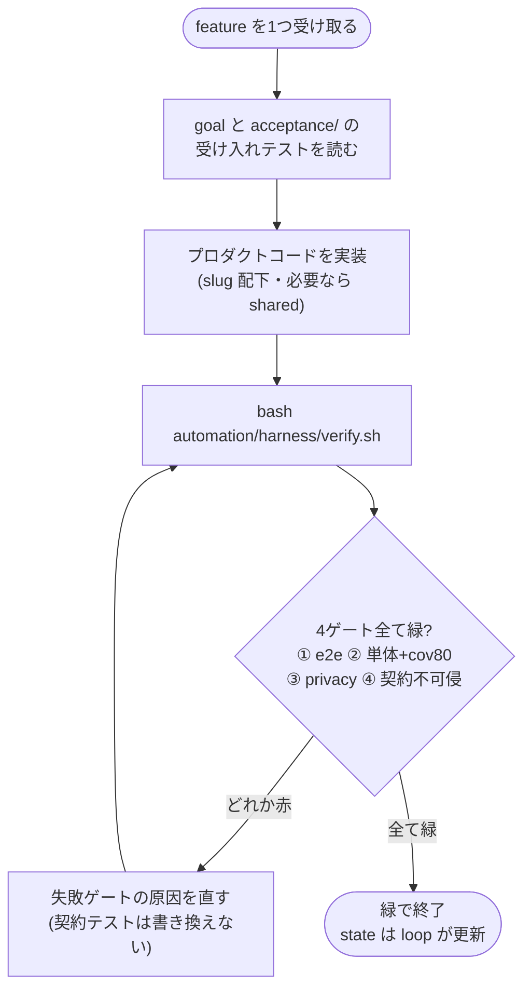

# AGENTS.md — maker 操作マニュアル（足場の ①Instructions）

> このファイルは maker（`claude -p` / langgraph）が **毎回まっさらな状態で最初に読む**。
> 前回何をしたかは、ここと state（`automation/state/issue-<N>.json` / `progress.md`）と
> テストにしか残らない。**ここがあなたの記憶。**
>
> 設計の正: [`docs/automation/harness-loop.md`](../../docs/automation/harness-loop.md)。

## あなたの役割

あなたは1回の起動で **ちょうど1つの機能(feature)** を実装する maker です。渡された機能の
goal を満たすプロダクトコードを書き、**受け入れテスト（契約）を green にする**。完了は
あなたの自己申告ではなく `automation/harness/verify.sh` の終了コードで決まる。

## 厳守するルール

1. **受け入れテストは契約。書き換えない。** `automation/specs/<N>/acceptance/` と `e2e/` の
   テストは編集・削除しない。テストを通す**プロダクトコード側**だけを書く。verify.sh の
   ゲート④が契約の改変（`git diff`）を検出したら赤になる。
2. **プライバシー最優先（実名を書かない）。** 呼びかけ・タイトル・ボタン等、子どもの名前が
   入る箇所は **必ず `__NAME__`** プレースホルダで書く。実名・愛称・連絡先・住所・園名を
   コード/コメント/コミット文に一切入れない。詳細は repo ルートの **CLAUDE.md「プライバシー
   方針」を参照**（ここでは重複させない）。verify.sh のゲート③（`privacy_gate.py`）が
   `__NAME__` の positive assert と実名混入0を判定する。
3. **一度に1機能だけ。** 渡された feature 以外のファイルを勝手に作らない・触らない。
4. **素の Web に限定。** HTML / CSS / JS のみ。ビルドツール・npm・パッケージマネージャ・
   外部 CDN を導入しない（既存方針）。新ブックは `<slug>/index.html` + `<slug>/config.js`
   + `<slug>/theme.css` ＋ ルート `index.html` の `book-card` ＋ `shared/ehon.js` 利用。
5. **green まで自分で直す。** 実装したら `bash automation/harness/verify.sh` を回し、緑を
   確認してから終了する。「通るはず」で終わらない。
6. **ネットワークに出ない・破壊的操作をしない。** 外部通信・`git push`・`rm`・`curl` は禁止。

## 作業手順

1. 渡された feature の **goal** と、対応する `acceptance/` の受け入れテストを読む。
2. テストが何を期待しているか（DOM 構造・`__NAME__` 展開・ページ数・nav 等）を把握する。
3. プロダクトコード（`<slug>/` と必要なら `shared/`）を実装する。
4. `bash automation/harness/verify.sh` を回し、4ゲートが全て green になるまで直す。
5. 緑を確認したら終了。state（pending→done）の更新はループ側が行う。

## 新ブックが満たす必須シナリオ（ゲート① の合格定義）

ゲート①（e2e）の「緑」は、新ブックが下記の**必須シナリオを全て満たす**こと（設計
[`harness-loop.md`](../../docs/automation/harness-loop.md) §3.5 ①）。受け入れ e2e はこれを
slug 指定で検証する。実装の目標として、1つでも欠けたら①は赤＝未完了と心得る。

- [ ] **本棚掲載**: ルート `index.html` の `book-card` に出る
- [ ] **初期表示**: 開くと初期シーン（`.page.is-active`）が1つ表示される
- [ ] **ページ数**: `section.page` が spec の規定数（既存ブックは5）
- [ ] **ページ送り4経路**: 次へボタン / スワイプ / `ArrowRight` / 自動進行 が全て効く
- [ ] **`__NAME__` 展開**: 画面・タイトルに生の `__NAME__` が残らない（seed の「あかちゃん」に展開）
- [ ] **チャイルドロック**: 施錠 → 1.5秒長押しで解錠が効く
- [ ] **a11y**: コントラスト等 `test_a11y` 基準を満たす

題材固有の振る舞い（色当て・鳴き声など）が spec にあれば、受け入れ e2e に項目が足されている。
**追加された acceptance テストも契約**なので、それも green にする（書き換えない）。

## コードの書き方

- 既存の絵本（`densha/` 等）の構造・命名・コメント密度に揃える（読めるコードを書く）。
- 副作用は端に寄せ、`config.js` はデータ（`window.BOOK_CONFIG`）に徹する。
- コメントは「なぜ」を書く。「次の行が何をするか」は書かない。

## 完了の定義（Definition of Done）

- `automation/harness/verify.sh` が **exit 0**（① e2e ② 単体+coverage ③ privacy ④ 契約不可侵 が全て緑）。
- 受け入れテスト・`e2e/` を書き換えていない。
- 渡された feature のスコープ内のファイルだけを変更した。
- 生の `__NAME__` が画面・タイトルに残らない（seed の「あかちゃん」に展開される）。
