# 絵本自動化ワークフロー（設計）— リサーチャー → 作成者 → こども → 人間承認

このドキュメントは、`yk0817/baby-ehon` リポジトリに導入予定の GitHub Actions 自動化の設計をまとめたもの。実装はこの設計が合意された後、別 PR で段階的に進める。

全体を **3 つのエージェント役 + 人間ゲート** のパイプラインとして組む。

- **リサーチャー** — 何を作る／update すべきかをリサーチし、Issue として提案・調査する
- **作成者** — Issue をもとにコードを書き、Draft PR を出す
- **こども（レビュワー）** — 対象である 1 歳児の視点で Draft PR を実際に触ってレビューする
- **人間（あなた）** — 最終承認。PR をレビューしてマージする

---

## 1. 目的・背景

### 現状

- このリポジトリは公開リポジトリで、HTML/CSS/JS のみの静的サイト（1 歳児向け絵本シリーズ）。ビルドツールやパッケージマネージャは導入していない
- ラインナップは 5 冊（`hikouki` / `densha` / `kuruma` / `otenki` / `yorunosora`）
- オープン中の Issue は #1〜#7 の 7 本（執筆時点）。すべて `enhancement` + `research-based` ラベル付きで、先行研究をベースにした改善提案
- これまで「何を作るか」の発案・Issue 棚卸し・優先度付け・PR 化・レビューはすべて手動。週末にまとめて回している

### 自動化したいこと

役ごとに整理する。

1. **リサーチャー（調査）— 毎日**: オープン中の全 Issue を調査し、Issue コメントとして書き込む
   - 研究根拠の補足（先行研究の名前を 2-4 件）
   - 実装難易度の見積もり（HTML/CSS/JS のみで実装可能か含む）
   - 優先度スコア（0-100）
   - 現在のラインナップに追加するならどんな機能か の提案
2. **リサーチャー（提案）— 週次**: 発達研究と現状ラインナップを踏まえ、「次に作るべき新しい絵本／既存絵本への機能追加」を **1 件、Issue として自動起票** する
3. **作成者 — 週次**: 直近の最高スコア Issue を 1 つ選び、実装して Draft PR を出す
4. **こども（レビュワー）— Draft PR ごと**: 対象児（1 歳）の発達視点で、絵本を **実際にブラウザで触りながら（スクリーンショット）かつコード差分を読んで**、PR にレビューコメントを書く
5. **人間 — 最終ゲート**: PR をレビューして、承認・マージする（自動マージは絶対にしない）

### 期待する効果

- research-based な改善 backlog が「人間が動かないと進まない」状態から、「リサーチャーが下調べ・発案し、作成者が初稿を書き、こどもレビュワーが所見を残し、人間が最終判断する」状態に移行する
- 「何を作るか」の発案まで自動化されるので、backlog が枯れない
- 対象児は言葉でフィードバックできないので、その代弁役（こどもレビュワー）を機械的に常設する

### 非ゴール

- 自動マージ（PR は常にドラフト、人間ゲート必須）
- こどもレビュワーに承認（Approve）権限を持たせること（あくまでコメントのみ）
- 個人情報を扱う処理（プライバシー方針上、絶対に行わない）

---

## 2. 役割パイプライン全体像

Issue 発案から merge までを、4 つの役の受け渡しとして俯瞰する。

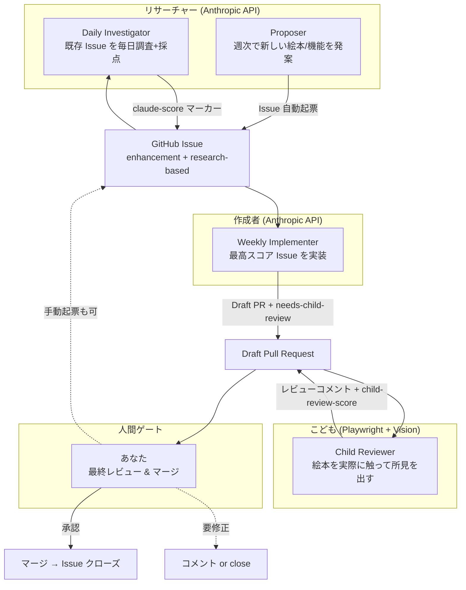

各役は独立した GitHub Actions ワークフローで、受け渡しは **Issue / PR / コメントマーカー** で行う（共有 DB を持たない）。

---

## 3. 全体アーキテクチャ

実行エンジンは **LangGraph + Anthropic API**（Python）。公式の `anthropics/claude-code-action` は使わず、自前のグラフを GitHub Actions Runner 上で動かす。こどもレビュワーのみ Playwright（ブラウザ操作）を併用する。

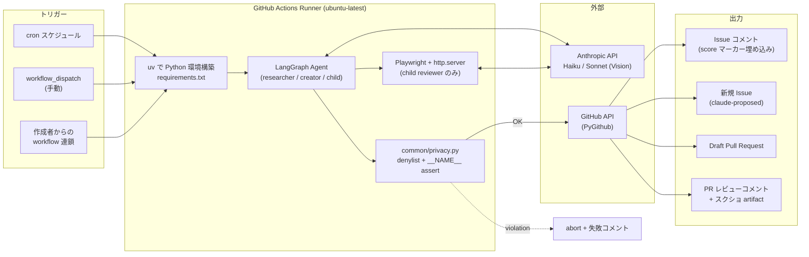

---

## 4. リサーチャー① — Daily Investigator（既存 Issue の調査）

### 4.1 LangGraph ノード構成

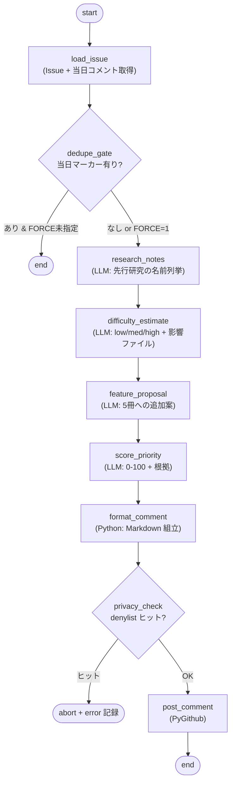

### 4.2 State スキーマ

```python
class DailyState(TypedDict):
    issue_number: int
    issue_title: str
    issue_body: str
    labels: list[str]
    existing_comments_today: bool
    research_notes: str
    difficulty: dict   # {level, html_css_js_feasible, notes}
    feature_proposal: str
    score: int         # 0-100
    score_rationale: str
    rendered_comment: str
    posted_comment_url: str | None
    errors: list[str]
```

### 4.3 スコア永続化（コメント埋め込みマーカー方式）

Daily Investigator が投稿する Issue コメントの **先頭** に、機械可読な HTML コメントを 2 行入れる。

```markdown
<!-- claude-score: 87 -->
<!-- claude-run: 2026-05-25 -->

## 📊 Claude 自動調査（2026-05-25）

### 研究根拠の補足
- PEER シーケンス（Whitehurst et al., 1988）...
- 共同注意と指差し（Tomasello, 1995）...

### 実装難易度
- **中**（HTML/CSS/JS で完結可能）
- 影響ファイル: `shared/ehon.js`, 各 `*/config.js`

### 優先度スコア: **87 / 100**
- 発達価値: 35/40
- 実装容易性: 22/25
- 5 冊横展開: 18/20
- アクセシビリティ: 12/15

### ラインナップへの追加提案
`hikouki/config.js` の `talks` 配列に問いかけフレーズを追加し、`shared/ehon.js` 側に「タップで応答待ち」モードを実装...
```

#### この方式を採用した理由

| 方式 | 採否 | 理由 |
|---|---|---|
| **コメント埋め込みマーカー** | ✅ 採用 | 単純・robust・履歴を汚さない |
| ラベル（`score:80-90` 等） | ❌ | 粒度が粗い、ラベル一覧がノイジーになる |
| リポ内 JSON ファイル | ❌ | 毎日 commit が走り履歴が汚染、race condition |
| GitHub Variables / Gist | ❌ | moving part が増える |

#### 当日 dedupe ロジック

`<!-- claude-run: YYYY-MM-DD -->` の日付（JST）が今日と一致するコメントが既に存在し、かつ環境変数 `FORCE=1` が未指定なら、当日の処理をスキップ。

### 4.4 リサーチャーの評価観点（採点ルーブリック）

リサーチャーが Issue を採点する／自分の発案を自己評価するときの **共通ルーブリック**。こどもレビュワーの 4 観点（§7.4）と対をなす。合計 100 点。Daily Investigator はこれで既存 Issue を採点し、Proposer（§5）は同じ軸で自分の案を自己評価して、合格ラインを下回る案は起票しない。

| 観点 | 配点 | 何を見るか | 0 点 | 中間 | 満点 |
|---|---|---|---|---|---|
| **発達価値** | /40 | 0-2 歳の発達に資するか。先行研究の裏付けがあるか（共同注意・音象徴・繰り返し・コントラスト感受性など） | 発達上の意味が薄い／研究根拠なし | 効果は見込めるが対象月齢がややズレる | 月齢に直結し、研究で裏付く |
| **実装容易性** | /25 | HTML/CSS/JS のみで完結するか。触るファイル数・複雑度 | ビルドツールや外部依存が要る | 数ファイルだが新規ロジックあり | 既存 `config.js`/`ehon.js` の素直な拡張 |
| **横展開性** | /20 | 5 冊（hikouki/densha/kuruma/otenki/yorunosora）に展開できるか。共通エンジン側で効くか | 1 冊専用で再利用できない | 一部の冊だけ適用可 | 共通エンジンに入り全冊に効く |
| **アクセシビリティ・安全性** | /15 | コントラスト・タップ報酬の即時性・誤操作で抜けない（チャイルドロック）・点滅/音が過多でない・`prefers-reduced-motion` | 安全/到達性に懸念 | おおむね配慮あり | 視覚発達期と安全に積極配慮 |

採点はコメント先頭の `<!-- claude-score: N -->` に総点を、本文に内訳（例: 発達価値 35/40 …）を出す（§4.3 のフォーマット）。

#### Proposer の合格ライン

Proposer（§5）は発案を起票する前に、上記 4 軸で自己採点する。**合計 60 点未満、または「実装容易性」が著しく低い（HTML/CSS/JS で完結しない）案は起票せず破棄**する。これにより「面白いが実装不能」「研究根拠の薄い思いつき」が backlog に流れ込むのを防ぐ。

### 4.5 cron とモデル

- cron: `0 0 * * *` （00:00 UTC = **09:00 JST 毎日**）
- モデル: `claude-haiku-4-5`（軽量、コスト最適化）
- 試算: 1 Issue あたり ~3K token × 7 Issue = ~21K token/日 → 1 日あたり 1 セント未満

---

## 5. リサーチャー② — Proposer（新しい絵本／機能の発案・Issue 自動起票）

「何を作るか」を人間が考える代わりに、リサーチャーが週次で 1 件発案して Issue を立てる。backlog が枯れないようにする役。

### 5.1 LangGraph ノード構成

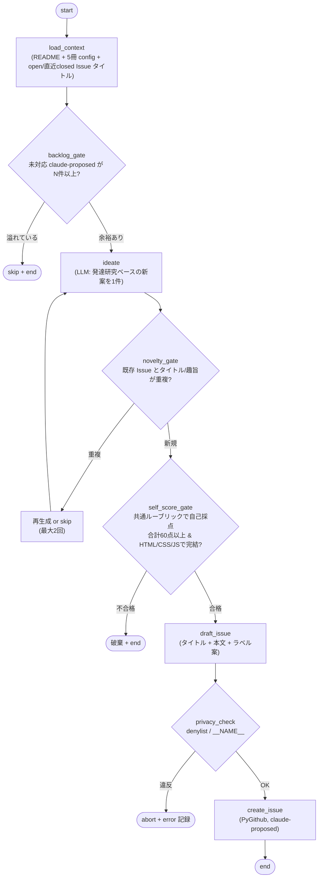

### 5.2 State スキーマ

```python
class ProposerState(TypedDict):
    lineup: list[str]                 # ["hikouki", "densha", ...]
    existing_open_titles: list[str]
    recent_closed_titles: list[str]
    pending_proposed_count: int       # 未対応 claude-proposed Issue 数
    idea: dict                        # {kind: "new_book"|"feature", title, summary, research_basis, target_files}
    self_score: dict                  # {dev_value, feasibility, reusability, a11y_safety, total} 共通ルーブリック自己採点
    issue_title: str
    issue_body: str
    created_issue_url: str | None
    errors: list[str]
```

### 5.3 発案の制約（プロンプト方針）

`ideate` ノードは次の制約のもとで 1 件だけ案を出す。

- **二択を明示させる**: `new_book`（新しい題材の絵本を 1 冊）か `feature`（既存 5 冊への横断機能）か
- **HTML/CSS/JS のみで実装可能**な範囲に限る（ビルドツール禁止）
- **発達研究の裏付け**を 1-3 件添える（共同注意・音象徴・繰り返し・コントラスト感受性など）
- 既存ラインナップ・既存 Issue と **重複しない**こと（`load_context` で渡したタイトル群を参照）
- 対象は **0-2 歳**。誤操作で抜けない・タップ報酬が即時・視覚刺激が過多でない、を満たす案

生成後、案を §4.4 の **共通ルーブリック（発達価値 / 実装容易性 / 横展開性 / アクセシビリティ・安全性）** で自己採点し、**合計 60 点未満 or HTML/CSS/JS で完結しない案は破棄**する（`novelty_gate` の後段 `self_score_gate`）。これにより「実装不能」「研究根拠の薄い思いつき」を起票前に弾く。

### 5.4 backlog 氾濫の防止

公開リポジトリに Issue を無制限に量産しないためのガード。

- **backlog_gate**: 未対応（open かつ未着手）の `claude-proposed` Issue が **N 件（既定 3）以上**溜まっていたら、その週は起票をスキップ
- **novelty_gate**: `load_context` が渡した既存 Issue タイトル・直近クローズ済みタイトルと、生成案のタイトル／趣旨が重複していたら再生成（最大 2 回）、それでも重複なら skip
- 起票した Issue 本文の先頭に `<!-- claude-proposed: 2026-05-25 -->` マーカーを入れ、後段（Daily / 集計）が機械判別できるようにする

### 5.5 起票する Issue のフォーマット

```markdown
<!-- claude-proposed: 2026-05-25 -->

## 提案: <案のタイトル>

**種別**: 新しい絵本 / 既存絵本への機能追加

### 背景・ねらい（発達研究）
- <研究根拠 1>
- <研究根拠 2>

### 提案内容
<何を、どの絵本に、どう足すか。HTML/CSS/JS のみで完結する前提で具体的に>

### 想定影響ファイル
- `shared/ehon.js`
- `<book>/config.js`
- ...

### 受け入れ条件（人間が後で詰める叩き）
- [ ] 5 冊（または対象冊）で挙動を確認
- [ ] `__NAME__` プレースホルダ以外に人名が入らない
- [ ] README ラインナップ / 構成の更新要否を判断

---
この Issue は Claude（リサーチャー Proposer）が自動起票しました。**内容は人間が精査してから着手してください。**
ラベル: `enhancement` `research-based` `claude-proposed`
```

### 5.6 cron とモデル

- cron: `0 0 * * 5` （00:00 UTC 金曜 = **09:00 JST 金曜**、週 1 件ペース）
- モデル: `claude-sonnet-4-6`（発案には弱モデルより発散と妥当性の両立が要る）
- 試算: 入力 ~8K token + 出力 ~2K token = ~10K token/週 → 1 週あたり数セント

---

## 6. 作成者 — Weekly Implementer

### 6.1 LangGraph ノード構成

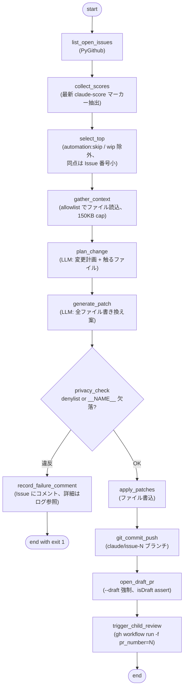

### 6.2 State スキーマ

```python
class WeeklyState(TypedDict):
    candidate_issues: list[dict]   # [{number, title, score, comment_url}]
    selected_issue: dict           # {number, title, body, score}
    context_files: dict[str, str]  # path -> contents
    change_plan: str
    proposed_patches: list[dict]   # [{path, new_contents}]
    privacy_violations: list[str]
    branch_name: str
    pr_url: str | None
    pr_number: int | None
    errors: list[str]
```

### 6.3 ファイル読込の allowlist

LLM に晒すリポジトリ内容を限定する。

| 必ず含める | 必要に応じて |
|---|---|
| `CLAUDE.md` | 対象 Issue が指す `*/index.html` |
| `README.md` | 対象 Issue が指す `*/theme.css` |
| `shared/ehon.js` | |
| `shared/ehon.css` | |
| 5 冊の `*/config.js` | |
| 代表 1 冊の `index.html` | |

合計サイズが 150KB を超えたらハードキャップで切り詰める。

### 6.4 PR 作成仕様

- **ブランチ命名**: `claude/issue-<N>`（日本語タイトルのローマ字化は不安定なので固定パターン）
- **コミットメッセージ**: Conventional Commits 形式（CLAUDE.md ルール準拠）
  - 例: `feat: <英語要約> (#N)`
  - 本文に `Refs #N`
  - `Co-Authored-By` で個人メアドは入れない
- **PR タイトル**: `[draft] <Issue タイトル> (#N)`
- **PR は常にドラフト**: `gh pr create --draft` + 事後 re-read で `isDraft == true` を assert
- **ラベル**: 作成時に `needs-child-review` を付与（こどもレビュワーのキー）
- **PR 本文テンプレ**:

```markdown
Closes #<N>

## 自動生成された変更案
<change_plan を埋め込み>

## 変更ファイル
- shared/ehon.js
- hikouki/config.js
- ...

## レビュー観点
- [ ] `__NAME__` プレースホルダ以外に人名が入っていないか
- [ ] HTML/CSS/JS のみで完結しているか
- [ ] 5 冊の絵本それぞれで挙動を確認したか
- [ ] README の「ラインナップ」「機能」「構成」セクション更新が必要か

---
このPRはClaude (LangGraph agent) が自動生成しました。**必ず人間がレビューしてからマージしてください。**
```

### 6.5 こどもレビュワーへの受け渡し

bot（`GITHUB_TOKEN`）が作成した PR は `pull_request` イベントを発火しない（再帰実行防止のための GitHub 仕様）。そのため作成者は PR 作成後、`trigger_child_review` ノードで明示的にこどもレビュワーを起動する。

- `gh workflow run child-review.yml -f pr_number=<N>`（要 `permissions: actions: write`）
- 人間が手で開いた PR は `child-review.yml` 側の `pull_request`（types: `opened`, `labeled`）でも起動できるようにしておく（二重起動は PR 上の既存レビューコメント有無で dedupe）

### 6.6 cron とモデル

- cron: `0 1 * * 1` （01:00 UTC 月曜 = **10:00 JST 月曜**）
- モデル: `claude-sonnet-4-6`（コード生成にはより強い推論が必要）
- 試算: 入力 ~45K token + 出力 ~10K token = ~55K token/週 → 1 週あたり数十セント

---

## 7. こども（レビュワー）— Child Reviewer

対象児（1 歳）は言葉でフィードバックできない。その代弁役として、Draft PR の絵本を **実際にブラウザで触り（スクリーンショット）＋コード差分を読んで**、発達視点の所見を PR に残す。**合否ゲートではなく所見**であり、Approve 権限は持たない。最終判断は人間。

### 7.1 LangGraph ノード構成

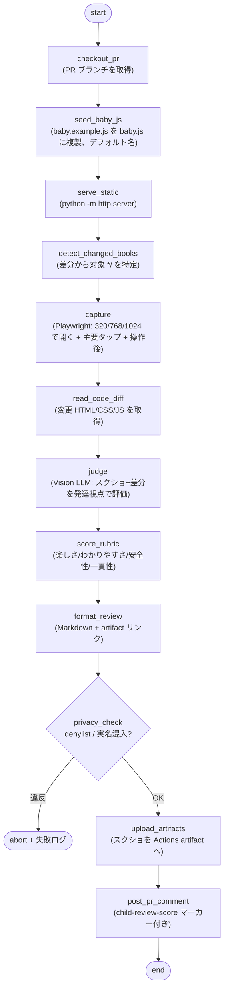

### 7.2 State スキーマ

```python
class ChildReviewState(TypedDict):
    pr_number: int
    branch: str
    changed_books: list[str]          # ["hikouki", ...]
    screenshots: list[dict]           # [{book, viewport, phase, path}]
    code_excerpts: dict[str, str]     # path -> diff/contents
    findings: list[dict]              # [{aspect, observation, severity}]
    rubric: dict                      # {fun, clarity, safety, consistency} 各0-5
    rendered_review: str
    artifact_url: str | None
    errors: list[str]
```

### 7.3 ブラウザ評価の手順

1. **checkout_pr**: 対象 PR のブランチを取得
2. **seed_baby_js**: `shared/baby.example.js` を `shared/baby.js` に複製する。これでデフォルト名「あかちゃん」が使われ、**実名を CI に持ち込まない**（プライバシー安全）
3. **serve_static**: `python -m http.server <port>` でリポジトリルートを配信
4. **detect_changed_books**: `git diff` で変更された `*/` を特定（無ければ本棚 `index.html` を対象）
5. **capture**: Playwright で対象絵本を **320 / 768 / 1024** で開く。各ビューポートで「初期表示」「主要タップ後」「ページ送り後」のスクショを撮る。チャイルドロック・自動再走行など主要インタラクションも操作する
6. **read_code_diff**: 変更された HTML/CSS/JS を取得（後述 allowlist 内）
7. **judge**: Vision 対応モデルにスクショ画像群とコード差分を渡し、1 歳児の発達視点で評価

### 7.4 評価ルーブリック（1 歳児視点）

`judge` ノードに与える観点。スコアは各 0-5。

| 観点 | 問い |
|---|---|
| 楽しさ (fun) | タップ／ドラッグに即時の視覚・音の報酬があるか。0-2 歳が「もう一回」したくなるか |
| わかりやすさ (clarity) | 操作対象が明白か。コントラストは十分か。要素が多すぎ・小さすぎないか |
| 安全性 (safety) | 誤操作で意図せず抜けたり外部遷移しないか（チャイルドロックが効くか）。点滅・音が過多でないか |
| 一貫性 (consistency) | 既存 5 冊と操作・トーン・命名が揃っているか。`__NAME__` 展開が正しく出ているか |

### 7.5 投稿するレビューのフォーマット

```markdown
<!-- child-review-score: fun=4 clarity=3 safety=5 consistency=4 -->
<!-- child-review-run: 2026-05-25 -->

## 👶 こどもレビュワーの所見（自動・所見のみ / 承認ではありません）

対象: `hikouki`（320 / 768 / 1024 で確認）
スクリーンショット: [Actions artifact](#)（このランの artifact を参照）

### 良かった点
- タップで飛行機が即座に動き、報酬が分かりやすい（fun 4/5）

### 気になった点
- ボタンのコントラストがやや弱く、対象児には見つけにくいかも（clarity 3/5）
- ページ送りの当たり判定が小さい

### ルーブリック
| 楽しさ | わかりやすさ | 安全性 | 一貫性 |
|---|---|---|---|
| 4/5 | 3/5 | 5/5 | 4/5 |

---
これは Claude（こどもレビュワー）が 1 歳児視点で生成した**所見**です。Approve ではありません。最終判断は人間が行ってください。
```

スクリーンショットは GitHub API で PR コメントに直接画像添付するのが難しいため、**Actions artifact にアップロードし、コメントからリンク参照**する。artifact の保持期間は短め（例 7 日）に設定する。

### 7.6 トリガーとモデル

- トリガー:
  - 作成者からの `gh workflow run child-review.yml -f pr_number=<N>`（bot PR 用）
  - `pull_request`（types: `opened`, `labeled`、`needs-child-review` ラベル）（人間 PR 用）
  - `workflow_dispatch`（手動再実行）
- 二重起動防止: PR 上に当日 `child-review-run` マーカー付きコメントがあれば skip
- モデル: `claude-sonnet-4-6`（**Vision 対応必須**。スクショ画像を読む）
- 試算: 入力 画像数枚 + コード ~30K token + 出力 ~3K token = 1 PR あたり ~40K token → 数セント／PR

### 7.7 ファイル読込・配信の allowlist

ブラウザ配信・コード読み込みともに、絵本ディレクトリと `shared/` に限定する。`.github/`、`docs/`、`.git/` は配信対象から外す（`http.server` のルート選定 or 明示パスで制御）。

---

## 8. プライバシー / 安全ガード

CLAUDE.md のプライバシー方針を Actions 経由でも貫徹する。**四重ガード** で防御する。全役（リサーチャー / 作成者 / こども）に共通適用する。

### 8.1 ガード 1: System Prompt

全 LLM 呼び出しに次のシステムプロンプトを前置する。

```text
あなたは baby-ehon リポジトリの自動化エージェントです。以下は絶対に守ること:

1. お子さんや家族の本名・愛称は、生成するあらゆるテキスト
   （コード、コメント、PR本文、Issueコメント、コミットメッセージ）に書かない
2. 絵本の呼びかけは必ず `__NAME__` プレースホルダで書く
3. 個人を特定しうる情報（住所・電話・メール・保育園名・GPS）も書かない
4. このリポジトリは公開リポジトリ。ログに残る前提で書く
5. 一般名詞（「お子さん」「対象児」「ユーザー」）で書く

ビルドツール禁止。HTML/CSS/JS のみ。
ファイル構成は README.md の「構成」セクションに従う。
```

### 8.2 ガード 2: denylist + __NAME__ positive assert

`.github/scripts/common/privacy.py` が単一の真実源。全役がコミット／コメント／Issue 投稿の直前にこれを通す。

- **hard-banned**（コード組込）: メール / 電話 / 住所っぽい文字列の regex
- **configurable denylist**: 環境変数 `BABY_EHON_NAME_DENYLIST`（カンマ区切り）。値はリポジトリには書かず、**リポジトリ Secret に登録** する
- **positive assert**: `*/config.js` の `talks` 配列要素に呼びかけ（vocative comma）があれば `__NAME__` が含まれていなければエラー

### 8.3 ガード 3: ログ漏洩防止

- 起動時に denylist 各値に対して `::add-mask::<token>` を発行（Actions ログ上でマスク表示される）
- raw Issue body や LLM 出力を INFO レベルでログ出力しない
- `redact()` ヘルパでログ出力前に denylist ヒットを除去

### 8.4 ガード 4: PR ドラフト必須 + こどもは承認不可

- PR は **常にドラフト** で作成
- auto-merge は絶対に設定しない
- こどもレビュワーは **コメントのみ**。Approve / Request changes の review state は付けない
- 人間がレビューしてから手動でマージする

### 8.5 こどもレビュワー固有のプライバシー配慮

ブラウザ操作はスクリーンショットを生むため、追加で次を守る。

- **実 `shared/baby.js` を CI に持ち込まない**。`baby.example.js` のデフォルト名（`あかちゃん`）で配信する。よってスクショに実名は写らない
- 絵本は抽象イラストのみで顔写真・自宅環境を含まない前提。万一、画像アセットが追加されている PR では、人物・自宅が写り込んでいないかを `judge` の観点に含め、疑わしければ artifact を上げずに人間にエスカレーション
- スクショ artifact の保持期間は短く（例 7 日）。public repo の artifact である点に留意

### 8.6 違反時の挙動

`privacy_check` ノードが違反を検出した場合:

1. コードのコミット・プッシュ、Issue 起票、PR コメントは **行わない**
2. 対象 Issue / PR に短いコメントを投稿: 「Claude が自動処理を試みたがプライバシーチェックで停止しました（詳細は Actions ログ参照）」
   - **本文には denylist の値を出さない**
3. ワークフロー全体を exit 1 で失敗扱いにする

---

## 9. ファイル配置（実装フェーズの参照用）

```
.github/
  workflows/
    daily-issue-investigation.yml       # cron 09:00 JST 毎日（リサーチャー①）
    weekly-issue-proposal.yml           # cron 09:00 JST 金曜（リサーチャー②）
    weekly-pr-from-top-issue.yml        # cron 10:00 JST 月曜（作成者）
    child-review.yml                    # PR トリガー / 連鎖（こども）
  scripts/
    requirements.txt                    # langgraph, langchain-anthropic, PyGithub, pydantic, playwright
    README.md                           # オペレータ向け: secrets, dry-run, ローカル再現
    common/
      privacy.py                        # 名前 denylist + __NAME__ positive assert
      github_io.py                      # PyGithub ラッパ
      gh_cli.py                         # ローカルデバッグ用 gh CLI ラッパ
      repo_reader.py                    # allowlist 制限付きファイル読み出し
      score_parser.py                   # claude-score / child-review-score マーカー抽出
      llm.py                            # Anthropic クライアント、モデル選択、トークン上限
    daily_investigator/
      graph.py nodes.py prompts.py run.py
    issue_proposer/
      graph.py nodes.py prompts.py run.py
    weekly_implementer/
      graph.py nodes.py prompts.py run.py
    child_reviewer/
      graph.py nodes.py prompts.py run.py
      browser.py                        # Playwright 起動 + スクショ + 静的配信
    tests/
      test_privacy.py
      test_score_parser.py
      test_redact.py
      test_novelty_gate.py              # Proposer 重複排除
docs/
  automation/
    agent-pipeline.md                     # 本ドキュメント
```

---

## 10. モデル選択とコスト試算

| 役 / ワークフロー | モデル | 入力 (token/run) | 出力 (token/run) | 頻度 | 月コスト見積（粗） |
|---|---|---|---|---|---|
| リサーチャー① Daily | `claude-haiku-4-5` | ~1.5K × 7 issue | ~1.6K × 7 issue | 毎日 | 1 ドル未満 |
| リサーチャー② Proposer | `claude-sonnet-4-6` | ~8K | ~2K | 週 1 | 1 ドル未満 |
| 作成者 Weekly | `claude-sonnet-4-6` | ~45K | ~10K | 週 1 | 数ドル |
| こども Child Review | `claude-sonnet-4-6` (Vision) | 画像数枚 + ~30K | ~3K | PR ごと（週 1 想定） | 数ドル |

`common/llm.py` で次のガードを設ける:

- `max_tokens` をノードごとに設定
- `MAX_TOKENS_PER_RUN=500000`
- `MAX_RUN_SECONDS=1500`

---

## 11. 検証手順

cron は最後に有効化する。次の順序で段階的に確認する。

1. **ローカル smoke test（リサーチャー①）**: `cd .github/scripts && DRY_RUN=true ONLY_ISSUE=1 python -m daily_investigator.run`
   - stdout に整形済みコメントが出ること、API 投稿は行わないこと
2. **ローカル smoke test（リサーチャー②）**: `DRY_RUN=true python -m issue_proposer.run`
   - 起票せず、生成された Issue 案と novelty_gate / backlog_gate の判定を stdout 確認
3. **ローカル smoke test（こども）**: `DRY_RUN=true PR_NUMBER=<既存PR> python -m child_reviewer.run`
   - Playwright がスクショを生成し、レビュー文を stdout に出すこと（PR 投稿なし）
4. **`workflow_dispatch` (dry_run=true)** で各ワークフローを起動
   - Secrets と `uv` / Playwright セットアップが通り、完走すること、書き込みなし
5. **`workflow_dispatch` (dry_run=false, issue_number=1)** で Daily を Issue #1 に実投稿
   - 内容と `<!-- claude-score: -->` 形式を目視確認、再実行で dedupe が効くこと
6. **Proposer を `workflow_dispatch` (dry_run=false)** で起動
   - `claude-proposed` Issue が 1 件立つこと、backlog_gate が溢れ時に skip すること
7. **Weekly を `workflow_dispatch` (dry_run=false)** で起動
   - ドラフト PR が作成され、`needs-child-review` が付き、child-review が連鎖起動すること
8. **こどもレビュワーの所見**が PR にコメントされ、スクショ artifact が参照できること
9. **cron 有効化** — 8 まで通ったら各 schedule ブロックを有効化してコミット

### 単体テスト

`.github/scripts/tests/` に以下を置く。`.github/scripts/**` を触る PR では pytest が走る CI を追加する。

- `test_privacy.py` — denylist regex が代表入力でヒットすることを確認
- `test_score_parser.py` — 各種コメント本文からの score / child-review-score 抽出を確認
- `test_redact.py` — ログ出力のマスキングを確認
- `test_novelty_gate.py` — Proposer の重複排除・backlog_gate を確認

---

## 12. リスクと判断

| リスク | 緩和策 | 残存リスク |
|---|---|---|
| プライバシー regression | denylist + `__NAME__` assert + dry-run デフォルト + ドラフト PR の四重ガード。こどもは実 baby.js を使わない | denylist Secret 未設定時は format check のみに低下 → 起動時に警告 |
| Issue スパム（Proposer 量産） | backlog_gate（未対応 N 件で停止）+ novelty_gate（重複排除）+ 週 1 件ペース | なし |
| Issue コメントスパム | 当日マーカー dedupe + `concurrency:` で同時実行防止 | なし |
| こどもレビュワーが承認に見える | review state を付けず comment のみ。文面に「所見・承認ではない」を明記 | なし |
| スクショに個人情報 | デフォルト名のみ配信、抽象イラスト前提、画像追加 PR は judge で人物検査 | 画像アセット追加時は人間確認が必要 |
| Playwright のセットアップ時間 | `uv` + `playwright install --with-deps chromium`、必要なら `actions/cache` | 軽微（1-2 分） |
| Sonnet が壊れた変更を出す | PR は常にドラフト、こども所見 + 人間が最終ゲート | 軽微 |
| スコア gaming / drift | 最新マーカー採用、人間が `score-lock` ラベルで上書き可 | 軽微 |

### 検討して却下した代替案

- **`anthropics/claude-code-action` を使う**: シンプルだが、per-node の scoring マーカー / dedupe 制御がやりにくい。ユーザー指定により LangGraph 路線で進める
- **こどもレビュワーをコード読みだけにする**: 軽量だが、対象児にとって重要な「見た目・コントラスト・操作の即時報酬」は実画面でしか分からない。ユーザー指定により **スクショ + コードの二刀流** を採用
- **こどもレビュワーに pull_request review（Approve/Request changes）を付与**: GitHub UI 上は分かりやすいが、自動 Approve は人間ゲート方針に反する。comment のみに限定

---

## 13. 実装ロードマップ

この設計ドキュメント PR がマージされたあと、次の順序で実装 PR を分割する。

1. **PR-1**: `.github/scripts/` 配下に LangGraph 最小骨格 + `requirements.txt` + README + `common/privacy.py` + `tests/test_privacy.py`（TDD で privacy を先に書く）
2. **PR-2**: リサーチャー① Daily Investigator 実装 + ローカル dry-run
3. **PR-3**: Daily の workflow YAML（`workflow_dispatch` のみ、cron はコメントアウト）+ secrets 登録の README 整備
4. **PR-4**: リサーチャー② Proposer 実装（ideate + novelty_gate + backlog_gate）+ `tests/test_novelty_gate.py` + ローカル dry-run
5. **PR-5**: Proposer の workflow YAML（同上）
6. **PR-6**: 作成者 Weekly Implementer 実装 + ローカル dry-run
7. **PR-7**: Weekly の workflow YAML（PR 作成 + `needs-child-review` 付与 + child-review 連鎖）
8. **PR-8**: こども Child Reviewer 実装（`browser.py` の Playwright + judge + rubric）+ ローカル dry-run
9. **PR-9**: child-review の workflow YAML（`pull_request` + `workflow_dispatch`、Playwright セットアップ）
10. **PR-10**: 検証手順 8 まで通った後、各 cron 有効化（schedule ブロックのアンコメント）

### 事前に必要な人間の作業

- リポジトリ Secrets に登録（Claude は触れない）
  - `ANTHROPIC_API_KEY` — Anthropic Console から発行
  - `BABY_EHON_NAME_DENYLIST` — `本名,愛称,...` のカンマ区切り
- ラベルの作成: `claude-proposed`, `needs-child-review`, `automation:skip`, `score-lock`

---

## 14. 処理フロー（シーケンス & ライフサイクル）

### 14.1 リサーチャー① Daily Investigator のシーケンス

cron 起動から Issue コメント投稿までの時系列インタラクション。

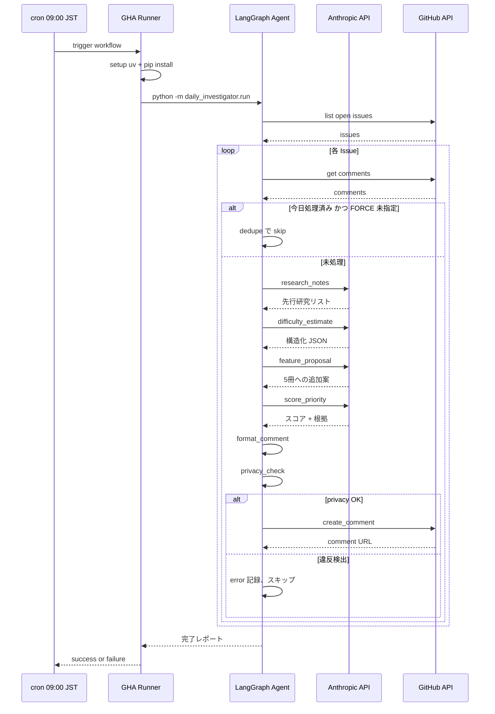

### 14.2 リサーチャー② Proposer のシーケンス

新しい絵本／機能の発案から Issue 自動起票まで。

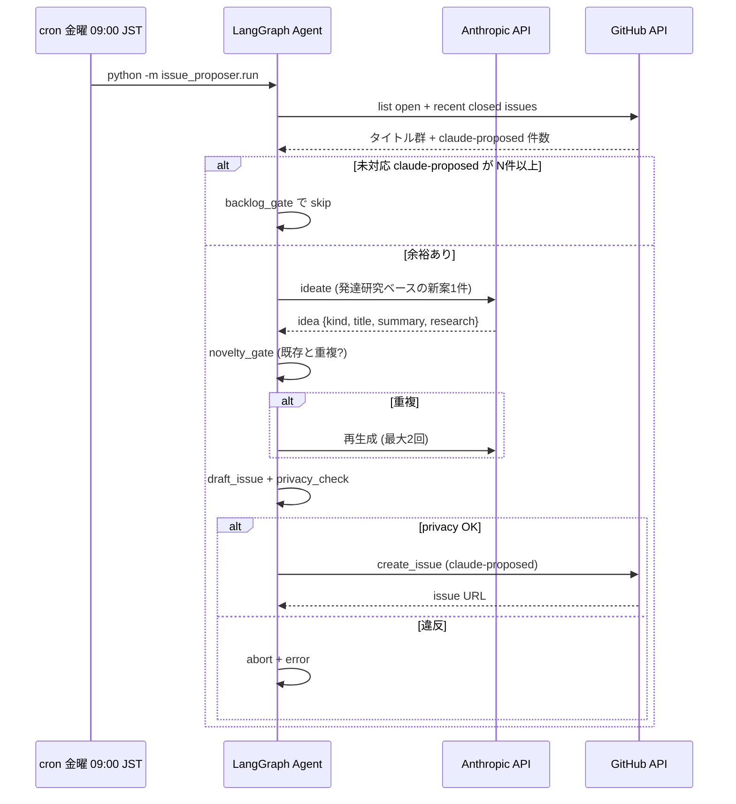

### 14.3 作成者 → こども → 人間のシーケンス

スコア集計から Draft PR、こども所見、人間レビューまでの時系列。

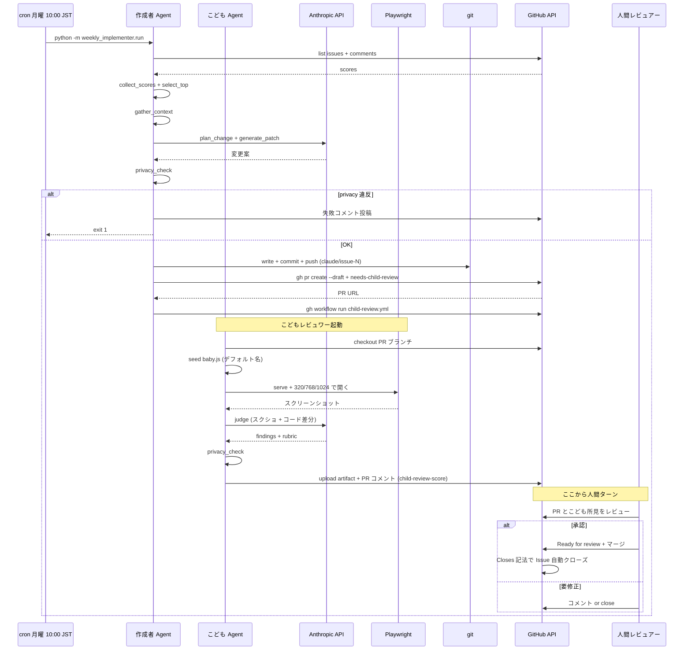

### 14.4 全体ライフサイクル

発案から merge までの 1 週間の流れ。

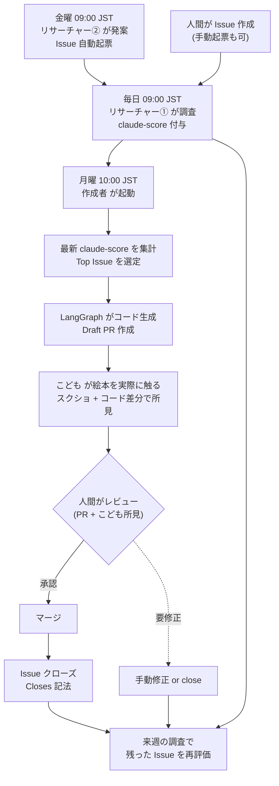

### 14.5 プライバシーガード適用ポイント

四重ガード（8 章）が処理のどこで効いているかを俯瞰する図。全役共通。

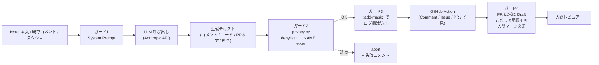
