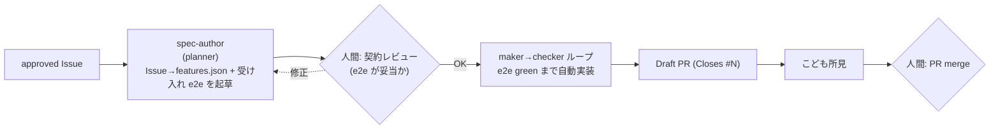

# ハーネス × ループ適用設計 — Issue を spec に、approved で実装ループを自動化

このドキュメントは、`~/harness-loop-lab`（ハーネスエンジニアリング＋ループエンジニアリングの学習ラボ）の考え方を `yk0817/baby-ehon` に適用する設計をまとめたもの。実装はこの設計が合意された後、別 PR で段階的に進める（`agent-pipeline.md` と同じ進め方）。

> **一言で**: 既存パイプラインの「approved → 一発で実装 → Draft PR」を、
> **「approved → Issue を spec 化 → maker→checker ループで e2e が green になるまで自動で直す → Draft PR」** に置き換える。
> モデルを賢くするのではなく、**モデルが確実に green を出す足場とループ**を組むのが主題。

関連ドキュメント:
- 既存の自動化パイプライン全体: [`agent-pipeline.md`](agent-pipeline.md)
- ラボの概念解説: `~/harness-loop-lab/docs/00-harness-engineering.md` / `01-loop-engineering.md`

---

## 1. 背景 — 既存パイプラインに欠けている1ピース

baby-ehon は既に **Issue → PR → 人間 merge** の自動化パイプラインを持つ（`agent-pipeline.md`）。役は「リサーチャー / 作成者 / こども / 人間ゲート2段（approved・merge）」。

```
発案 → 調査(claude-score) → 【人間: approved】 → 作成者が実装 → Draft PR → こども所見 → 【人間: merge】
```

そして **検証(③)の資産はすでにある**:

| 資産 | 役割 |
|---|---|
| `e2e/`（pytest-playwright） | 絵本本体の客観的な合否ゲート（smoke / navigation / child-lock / keyboard / a11y / name-and-bubbles / animal-cry） |
| `e2e/pages.py` の `BOOK_SLUGS` と Page Object | 「正しい絵本」の共通構造（`section.page` / `.is-active` / `data-scene` / nav / child-lock / dots / `__NAME__`展開）を**契約**として固定済み |
| `.github/scripts/tests/`（pytest） | 自動化エージェント側の契約 |

**欠けているのは harness-loop-lab の核心「maker→checker ループ」**:

- 既存の作成者（Weekly Implementer, `agent-pipeline.md` §6）は `generate_patch` を **一発**で出して Draft PR を開くだけ。
- e2e は PR 上の**別 CI**（`e2e-ui.yml`）として走るが、**「赤なら失敗を maker に返して green まで再試行する」ループが無い**。
- 結果、初稿が e2e で赤でも PR は開いてしまい、修正は人間 or 次サイクル待ち。

harness-loop-lab はまさにこの一周（**1機能ずつ → 実装 → テスト検証 → 赤なら原因を渡して再試行 → green で完了**）を回す。本設計はこれを baby-ehon に持ち込む。

### このドキュメントの方針（合意済み）

- **適用の形**: 既存CI作成者を **maker→checker ループ化**し、足場5要素を導入する（ラボの `loop/` `harness/` 相当を baby-ehon に置く）。
- **Issue = spec**: approved された Issue を spec として扱い、そこから実装ループを自動で回す。
- **最初の対象**: 新しい絵本を1冊（ラボの `example-toc-tool` に相当する“動く見本”）。

---

## 2. ハーネス5要素を baby-ehon に対応づける

ラボの「足場の5要素」を、baby-ehon の既存資産に写像する。**新規に作るのは太字**、それ以外は既存の再利用。

| # | 要素 | ラボでの実体 | baby-ehon での実体 |
|---|------|------|------|
| ① | **Instructions（指示書）** | `harness/AGENTS.md` | **`automation/harness/AGENTS.md`** — maker 用の実装マニュアル。CLAUDE.md のプライバシー方針（`__NAME__` 必須・実名禁止）＋「1機能ずつ・e2e は契約で書き換え禁止・green まで直す・HTML/CSS/JS のみ」。CLAUDE.md と重複させず参照する |
| ② | **State（状態）** | `workspace/state.json` + `progress.md` | **`automation/state/issue-<N>.json` + `progress.md`**（ブランチ上、または Actions artifact）。features の pending/done/failed と試行回数・last_error を持ち、**途中で落ちても再開可能** |
| ③ | **Verification（検証）** | `harness/verify.sh`（pytest） | **`automation/harness/verify.sh`** = `e2e/`（pytest-playwright）＋ `.github/scripts/tests/`（pytest）を**人間・loop・CI が同じ1コマンド**で回す。新ブックの受け入れは既存 e2e battery を slug でパラメタライズ |
| ④ | **Scope（範囲）** | `specs/*/features.json`（1機能ずつ） | **Issue から導出した features.json**。1機能=半日粒度に割り、1つずつ maker に渡す |
| ⑤ | **Session Lifecycle（始末）** | `harness/init.sh` | **`automation/harness/init.sh`** = 既存 `e2e/conftest.py` の作法を再利用（`baby.example.js → baby.js` seed・`http.server` 配信・`playwright install`・依存チェック）。終了時は green ＋ state 記録で締める |

### 検証(③)が最重要 — 「正しい絵本」の契約は既に存在する

`e2e/pages.py` は**標準ブックの構造を契約として固定済み**:

```
1冊の絵本 = <slug>/index.html  （section.page 複数・data-scene・nav・child-lock・dots）
          + <slug>/config.js    （window.BOOK_CONFIG: title/scenes/talks、__NAME__ を含む）
          + <slug>/theme.css
          + root index.html に <a class="book-card" href="<slug>/">
          + e2e/pages.py の BOOK_SLUGS に slug 追加
```

→ 新ブックがこの構造に従えば、`test_smoke` / `test_navigation` / `test_child_lock` / `test_a11y` などが**そのまま合否ゲートになる**。loop の checker はほぼ揃っている。

---

## 3. ループ設計 — maker→checker と「自己採点させない」

### 3.1 一周のフロー（ラボ `loop/run_loop.py` の写像）

```
state を読む（無ければ Issue 由来の features.json から作る）
while まだ終わってない and 上限内:
    feature = 次の未完了機能を1つ取る           # ④Scope
    その機能の受け入れ e2e を workspace に置く    # ③契約
    maker.implement(feature, feedback=前回のエラー) # 作る（claude -p / LangGraph / mock）
    ok, log = verify()                          # ③点検（e2e + pytest）
    ok なら done、赤なら失敗を記録して再試行       # ②State 更新（不変オブジェクト）
    state.json と progress.md を保存             # ②記憶を会話の外に残す
report()
```

ポイント（ラボと同じ）: **maker は毎回まっさらで呼ばれる**。前回の記憶は AGENTS.md・state.json・progress.md・テストにしか無い。

### 3.2 maker / checker 分離 = 「作った本人に採点させない」

harness の一番大事な原則。baby-ehon では:

- **checker = e2e/pytest（決定的・客観）**。maker はこれを green にするコードを書くだけで、**テストファイルは書き換え禁止**（AGENTS.md で明文化＋ verify が `git diff` で e2e の改変を検出したら失敗）。
- 受け入れ e2e（契約）は **maker とは別の主体**が用意する（§4.2）。これで「実装者がテストを甘くして自己採点する」罠を防ぐ。

### 3.3 maker エンジンの抽象化（ラボ `claude_runner.py` の Maker 基底）

ラボは maker を `Maker` インタフェースで抽象化し、`MockClaudeMaker` / `RealClaudeMaker` を差し替える。baby-ehon でも同じく抽象化する:

| maker | 用途 |
|---|---|
| `MockMaker` | フィクスチャ配置でオフライン・決定的にループ自体をテスト（CI で外部依存ゼロ） |
| `ClaudeCliMaker` | `claude -p`（headless）。AGENTS.md を自動で読み、ファイル編集＋pytest 実行を自分で行う。`--permission-mode acceptEdits` / `--allowedTools` / `--max-budget-usd` の安全装置付き |
| `LangGraphMaker` | 既存 `weekly_implementer`（OpenAI SDK）を maker として包む |

> **【決定事項 A — 要確認】maker エンジンをどれにするか。**
> 既存パイプラインは意図的に `claude-code-action` を避け LangGraph+OpenAI を採用済み（`agent-pipeline.md` §12）。一方ラボの「agent がファイルを編集し自分で pytest を回す・AGENTS.md を読む」性質は `claude -p` が最も素直。
> **推奨**: ループ本体はエンジン非依存に作り（`Maker` 基底）、**まずローカルは `ClaudeCliMaker`、CI は当面 `LangGraphMaker` を既定**にして差し替え可能にする。CI で `claude -p` を使うなら `ANTHROPIC_API_KEY` と claude CLI 導入（公式 action か npm）が要る——この一点だけ合意してから着手したい。

### 3.4 安全装置（ラボ `loop/config.py` の写像）

| つまみ | 役割 | 既定 |
|---|---|---|
| `max_iters` | maker 呼び出しの総回数上限 | 12 |
| `max_retries` | 1機能あたりの再挑戦上限 | 3 |
| `max_budget_usd` | 本番時の金額上限（`claude --max-budget-usd`） | 1.0 |
| `level` | 自動化レベル L1/L2/L3 | **L2**（実装するが PR は人間 merge 必須なので） |
| `MAX_RUN_SECONDS` | 実行時間上限（CI の timeout-minutes と二重化） | 1500 |

自動化レベル（ラボと同じ段階的ロールアウト）:
- **L1 レポート**: 計画と現状だけ報告。実装しない（一番安全・まず現状把握）。
- **L2 半自動（baby-ehon の既定）**: ループで green まで実装するが、**Draft PR を開いて人間が merge**。既存の人間ゲート2段と整合。
- **L3 無人**: 反復を全部任せる。baby-ehon では **使わない**（公開リポ・自動 merge 禁止方針）。

---

## 4. Issue を spec に変換する

### 4.1 spec バンドルの構造（ラボ `specs/<name>/` の写像）

approved Issue 1本 → spec バンドル1つ:

```
automation/specs/issue-<N>/
├── spec.md            # 人間が読む仕様（= Issue 本文を整形したもの）
├── features.json      # 機械が読む機能リスト（1機能=1エントリ。id/title/goal/acceptance_test）
└── acceptance/        # 各機能の契約（= 受け入れ e2e テスト）
    └── test_<slug>.py
```

### 4.2 「誰が契約（受け入れ e2e）を書くか」 — 自己採点を防ぐ二段ゲート

harness の肝。maker に契約を書かせない。spec 化を**実装ループの前段**に独立させる:



- **spec-author（planner）**: approved Issue を読み、(1) features.json に3機能前後へ分解、(2) 受け入れ e2e を `automation/specs/issue-<N>/acceptance/` に起草する。新ブックなら既存 `e2e/pages.py` ヘルパを使い「shelf に出る・初期シーン・N ページ・`__NAME__` 展開なし・child-lock・a11y」を slug でパラメタライズした `test_<slug>.py` を生成。
- **人間ゲート（契約）**: 生成された **受け入れ e2e を人間がレビュー**してから loop を回す。これが「テスト＝契約を人間が握る」担保（ラボ `docs/03` の推奨どおり、契約だけは AI に丸投げしない）。approved ラベルの意味を「実装してよい」から「**この契約で実装してよい**」へ一段深める運用。
- **maker**: 契約には触れず、green にする**プロダクトコード**（`<slug>/` と必要なら `shared/`）だけを書く。

### 4.3 既存パイプラインとの接続

`agent-pipeline.md` の作成者（Weekly Implementer）の役割を**ループのオーケストレータ**に置き換える:

| 既存（一発実装） | 本設計（ループ） |
|---|---|
| `select_top`（approved 最上位を選ぶ） | 同左（再利用） |
| `gather_context` → `plan_change` → `generate_patch` → `apply` | **spec-author で spec 化 → loop で green まで反復** に置換 |
| `open_draft_pr`（一発の差分） | **loop が green を出した workspace の差分**で Draft PR |
| `trigger_child_review` | 同左（再利用） |

`stage:implemented` ラベル・`needs-child-review` 連鎖・`Closes #N`・プライバシー四重ガード（§8）は**そのまま流用**する。

---

## 5. ディレクトリ配置（実装フェーズの参照用）

```
automation/                      # ★新規: harness × loop の本体（.github/scripts とは別レイヤ）
├── harness/
│   ├── AGENTS.md                #  ①Instructions（maker が毎回読む）
│   ├── init.sh                  #  ⑤Lifecycle（依存チェック + baby.js seed + playwright）
│   └── verify.sh                #  ③Verification（e2e + scripts pytest を1コマンド）
├── loop/
│   ├── run_loop.py              #  ループ本体（plan→(maker→checker)×N→report）
│   ├── state.py                 #  ②State（不変・永続化・再開可能）
│   ├── config.py                #  安全装置（max_iters/retries/budget/level）
│   ├── maker.py                 #  Maker 基底 + Mock/ClaudeCli/LangGraph 差し替え
│   └── spec_author.py           #  approved Issue → features.json + 受け入れ e2e 起草
├── specs/
│   └── issue-<N>/               #  Issue 由来の spec バンドル（spec.md/features.json/acceptance/）
├── state/                       #  ②State 永続化（issue-<N>.json / progress.md）
└── tests/                       #  ループ自身のテスト（--mock で決定的に検証）
    ├── test_state.py
    └── test_loop_mock.py

.github/workflows/
└── weekly-pr-from-top-issue.yml # 既存を改修: 一発実装 → loop オーケストレーションに
```

> `.github/scripts/`（既存 LangGraph エージェント群）はそのまま残し、`automation/` を**新レイヤ**として足す。作成者ワークフローが両者を橋渡しする。

---

## 6. 最初の対象 — 新しい絵本を1冊（動く見本）

ラボの `example-toc-tool`（mock 付きでオフライン体験できる“動く見本”）に相当するものを baby-ehon に作る。

- **題材**: 簡単な1冊（例: くだもの／のりもの等）。approved Issue 起点でも、デモ用に手書き spec でもよい（Phase 1 で確定）。
- **features 分割例**（1冊を3機能に割る）:
  1. `F1-config`: `<slug>/config.js` に `window.BOOK_CONFIG`（title に `__NAME__`、scenes/talks）を実装。
  2. `F2-page`: `<slug>/index.html` を標準構造（`section.page`×N・nav・child-lock・dots）で実装し、`shared/ehon.js` を読む。
  3. `F3-shelf`: root `index.html` に `book-card` 追加 ＋ `<slug>/theme.css`。
- **受け入れ e2e（契約）**: `automation/specs/issue-<N>/acceptance/test_<slug>.py` に、`e2e/pages.py` ヘルパで「shelf に出る・初期シーン表示・N ページ・`__NAME__` 生残りなし・child-lock 効く・a11y」を slug 指定で検証。
- **mock フィクスチャ**: `automation/loop/fixtures/<feature.id>/` に参照実装を置き、`--mock` でオフライン・無課金でループ自体を E2E テスト（CI で回せる）。

これで「spec を渡すと、足場の上でループが回り、e2e green の新ブックが出来上がる」が baby-ehon 内で再現される。

---

## 7. プライバシー / 安全（既存方針の貫徹）

`agent-pipeline.md` §8 の四重ガードと CLAUDE.md のプライバシー方針を**そのまま適用**する。ループ固有の追加点:

- **maker の指示書（AGENTS.md）に `__NAME__` 必須・実名禁止を明記**し、毎回読ませる。
- **verify.sh / loop の完了判定に privacy チェックを含める**: `__NAME__` positive assert と denylist（既存 `.github/scripts/common/privacy.py` を再利用）を green 条件に入れる。1つでも実名が混じれば赤＝未完了。
- **maker の権限を最小化**: `ClaudeCliMaker` は `--allowedTools` を Read/Edit/Write/pytest に限定、`git push`/`rm`/`curl` を `--disallowedTools` で禁止（ラボ `claude_runner.py` と同じ多層）。
- **L3（無人 merge）は使わない**。PR は常に Draft・人間 merge 必須。
- baby.js seed は `baby.example.js`（既定名「あかちゃん」）のみ。実 `baby.js` をループ／CI に持ち込まない（既存 conftest と同方針）。

---

## 8. 検証手順（段階的に信頼を積む）

ラボの「L1 → mock → 本番」と同じ順で確認する。

1. **ループ自身のテスト（外部依存ゼロ）**: `automation/tests/` を pytest。state 機械 ＋ `--mock` での E2E（足場×ループが動くか）。
2. **L1（レポートのみ）**: `python -m automation.loop.run_loop --spec automation/specs/issue-<N> --level L1`。何が作られるかの計画だけ確認。
3. **`--mock`（オフライン体験）**: フィクスチャでループを最後まで回し、`verify.sh`（e2e）が green になることを確認。
4. **ローカル本番（`ClaudeCliMaker`）**: `--model sonnet --max-budget-usd 1.0` で実際に新ブックを実装させ、e2e green を確認。
5. **CI 統合（`workflow_dispatch`, dry-run）**: 作成者ワークフローが spec 化 → loop → Draft PR の連鎖を完走（書き込みなし）。
6. **CI 本番（approved Issue 1本）**: Draft PR が e2e green の状態で開き、`needs-child-review` 連鎖・`Closes #N` が効くこと。
7. **cron は最後に有効化**。

### ループ／足場のテスト（契約コメント付き）

- `test_state.py` — 不変 state 機械（pending→in_progress→done/failed、再開）。
- `test_loop_mock.py` — `--mock` で maker→checker→state 更新の一周が回ること。
- `test_spec_author.py` — Issue 本文から features.json／受け入れ e2e が決定的に起草されること（LLM 部分はスタブ注入してオフライン）。

---

## 9. 実装ロードマップ（PR 分割・TDD）

この設計 PR がマージされたあと、次の順で実装 PR を分ける（各 PR は approved Issue → `claude/issue-<N>` ブランチ、TDD）。

1. **PR-1**: `automation/` 骨格 ＋ `loop/state.py`・`loop/config.py` ＋ `tests/test_state.py`（不変 state を先に TDD）。
2. **PR-2**: `harness/AGENTS.md`・`init.sh`・`verify.sh`（e2e + pytest を1コマンド化）。
3. **PR-3**: `loop/maker.py`（`Maker` 基底 + `MockMaker`）＋ `loop/run_loop.py` ＋ `tests/test_loop_mock.py`（mock で一周を E2E）。
4. **PR-4**: `loop/spec_author.py`（Issue→features.json + 受け入れ e2e 起草、LLM はスタブ可能に）＋ `tests/test_spec_author.py`。
5. **PR-5**: 新ブック1冊の spec バンドル ＋ mock フィクスチャ（“動く見本”を `--mock` で完走）。
6. **PR-6**: `ClaudeCliMaker`（or `LangGraphMaker`）でローカル本番ループを通す（決定事項 A の合意後）。
7. **PR-7**: 既存 `weekly-pr-from-top-issue.yml` を loop オーケストレーションへ改修（`workflow_dispatch` のみ・cron は据え置き）。
8. **PR-8**: CI で approved Issue 1本を通し（Draft PR + child-review 連鎖）、検証手順6まで確認。
9. **PR-9**: cron 有効化。

### 着手前に必要な合意・人間作業

- **決定事項 A（§3.3）**: CI の maker エンジン（`claude -p` か LangGraph か）を確定。`claude -p` 採用なら `ANTHROPIC_API_KEY` Secret 登録と claude CLI 導入方針。
- approved ラベルの運用更新（§4.2）: 「実装してよい」→「**この受け入れ e2e で実装してよい**」へ意味を一段深める。
- 既存 Secrets / denylist（`agent-pipeline.md` §13）はそのまま流用。

---

## 10. 検討した代替案と判断

| 案 | 採否 | 理由 |
|---|---|---|
| **既存作成者をループ化（本設計）** | ✅ 採用 | 検証資産（e2e）が既にあり、欠けているのは maker→checker ループだけ。最小の追加で最大効果 |
| ローカル専用 lab を別建て（ラボそのままコピー） | △ 部分採用 | ローカル `ClaudeCliMaker` として残すが、本命は CI 統合（ユーザー指定 = 既存CI作成者のループ化） |
| maker に受け入れテストも書かせる | ❌ | 自己採点の罠。契約は spec-author + 人間ゲートで握る（harness の肝） |
| L3 無人 merge | ❌ | 公開リポ・自動 merge 禁止方針（`agent-pipeline.md` 非ゴール）に反する |
| `claude-code-action` を全面採用 | △ 保留 | 既存が意図的に避けている。決定事項 A として別途合意 |
