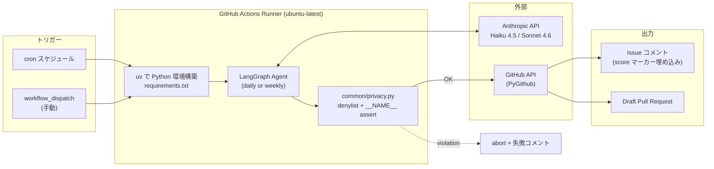
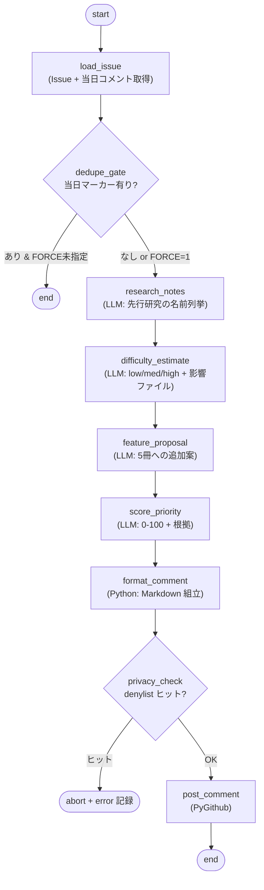
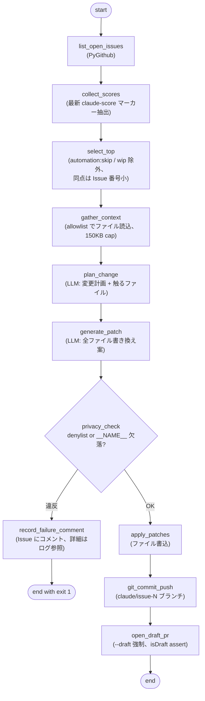

# Issue 自動調査 & 週次 PR 生成ワークフロー（設計）

このドキュメントは、`yk0817/baby-ehon` リポジトリに導入予定の GitHub Actions 自動化の設計をまとめたもの。実装はこの設計が合意された後、別 PR で段階的に進める。

---

## 1. 目的・背景

### 現状

- このリポジトリは公開リポジトリで、HTML/CSS/JS のみの静的サイト（1 歳児向け絵本シリーズ）。ビルドツールやパッケージマネージャは導入していない
- オープン中の Issue は #1〜#7 の 7 本（執筆時点）。すべて `enhancement` + `research-based` ラベル付きで、先行研究をベースにした改善提案
- これまで Issue の棚卸し・優先度付け・PR 化はすべて手動。週末にまとめて回している

### 自動化したいこと

1. **毎日**: オープン中の全 Issue を Claude が調査し、次の内容を Issue コメントとして書き込む
   - 研究根拠の補足（先行研究の名前を 2-4 件）
   - 実装難易度の見積もり（HTML/CSS/JS のみで実装可能か含む）
   - 優先度スコア（0-100）
   - **現在のラインナップ（hikouki / densha / kuruma / otenki / yorunosora）に追加するならどんな新機能か** の提案
2. **毎週月曜**: 直近の最高スコア Issue を Claude が 1 つ選び、実装してドラフト PR を出す（人間が必ずレビュー＆マージ）

### 期待する効果

- research-based な改善 backlog が「人間が動かないと進まない」状態から、「Claude が下調べと初稿を出し、人間がレビューする」状態に移行する
- 週次の優先度判断材料が常に最新の状態でコメントに残る

### 非ゴール

- 自動マージ（PR は常にドラフト、人間ゲート必須）
- 個人情報を扱う処理（プライバシー方針上、絶対に行わない）

---

## 2. 全体アーキテクチャ

実行エンジンは **LangGraph + Anthropic API**（Python）。公式の `anthropics/claude-code-action` は使わず、自前のグラフを GitHub Actions Runner 上で動かす。



---

## 3. Daily Investigator

### 3.1 LangGraph ノード構成



### 3.2 State スキーマ

```python
class DailyState(TypedDict):
    issue_number: int
    issue_title: str
    issue_body: str
    labels: list[str]
    existing_comments_today: bool
    research_notes: str
    difficulty: dict   # {level, html_css_js_feasible, notes}
    feature_proposal: str
    score: int         # 0-100
    score_rationale: str
    rendered_comment: str
    posted_comment_url: str | None
    errors: list[str]
```

### 3.3 スコア永続化（コメント埋め込みマーカー方式）

Daily Investigator が投稿する Issue コメントの **先頭** に、機械可読な HTML コメントを 2 行入れる。

```markdown
<!-- claude-score: 87 -->
<!-- claude-run: 2026-05-25 -->

## 📊 Claude 自動調査（2026-05-25）

### 研究根拠の補足
- PEER シーケンス（Whitehurst et al., 1988）...
- 共同注意と指差し（Tomasello, 1995）...

### 実装難易度
- **中**（HTML/CSS/JS で完結可能）
- 影響ファイル: `shared/ehon.js`, 各 `*/config.js`

### 優先度スコア: **87 / 100**
- 発達価値: 35/40
- 実装容易性: 22/25
- 5 冊横展開: 18/20
- アクセシビリティ: 12/15

### ラインナップへの追加提案
`hikouki/config.js` の `talks` 配列に問いかけフレーズを追加し、`shared/ehon.js` 側に「タップで応答待ち」モードを実装...
```

#### この方式を採用した理由

| 方式 | 採否 | 理由 |
|---|---|---|
| **コメント埋め込みマーカー** | ✅ 採用 | 単純・robust・履歴を汚さない |
| ラベル（`score:80-90` 等） | ❌ | 粒度が粗い、ラベル一覧がノイジーになる |
| リポ内 JSON ファイル | ❌ | 毎日 commit が走り履歴が汚染、race condition |
| GitHub Variables / Gist | ❌ | moving part が増える |

#### 当日 dedupe ロジック

`<!-- claude-run: YYYY-MM-DD -->` の日付（JST）が今日と一致するコメントが既に存在し、かつ環境変数 `FORCE=1` が未指定なら、当日の処理をスキップ。

### 3.4 cron とモデル

- cron: `0 0 * * *` （00:00 UTC = **09:00 JST 毎日**）
- モデル: `claude-haiku-4-5`（軽量、コスト最適化）
- 試算: 1 Issue あたり ~3K token × 7 Issue = ~21K token/日 → 1 日あたり 1 セント未満

---

## 4. Weekly Implementer

### 4.1 LangGraph ノード構成



### 4.2 State スキーマ

```python
class WeeklyState(TypedDict):
    candidate_issues: list[dict]   # [{number, title, score, comment_url}]
    selected_issue: dict           # {number, title, body, score}
    context_files: dict[str, str]  # path -> contents
    change_plan: str
    proposed_patches: list[dict]   # [{path, new_contents}]
    privacy_violations: list[str]
    branch_name: str
    pr_url: str | None
    errors: list[str]
```

### 4.3 ファイル読込の allowlist

LLM に晒すリポジトリ内容を限定する。

| 必ず含める | 必要に応じて |
|---|---|
| `CLAUDE.md` | 対象 Issue が指す `*/index.html` |
| `README.md` | 対象 Issue が指す `*/theme.css` |
| `shared/ehon.js` | |
| `shared/ehon.css` | |
| 5 冊の `*/config.js` | |
| 代表 1 冊の `index.html` | |

合計サイズが 150KB を超えたらハードキャップで切り詰める。

### 4.4 PR 作成仕様

- **ブランチ命名**: `claude/issue-<N>`（日本語タイトルのローマ字化は不安定なので固定パターン）
- **コミットメッセージ**: Conventional Commits 形式（CLAUDE.md ルール準拠）
  - 例: `feat: <英語要約> (#N)`
  - 本文に `Refs #N`
  - `Co-Authored-By` で個人メアドは入れない
- **PR タイトル**: `[draft] <Issue タイトル> (#N)`
- **PR は常にドラフト**: `gh pr create --draft` + 事後 re-read で `isDraft == true` を assert
- **PR 本文テンプレ**:

```markdown
Closes #<N>

## 自動生成された変更案
<change_plan を埋め込み>

## 変更ファイル
- shared/ehon.js
- hikouki/config.js
- ...

## レビュー観点
- [ ] `__NAME__` プレースホルダ以外に人名が入っていないか
- [ ] HTML/CSS/JS のみで完結しているか
- [ ] 5 冊の絵本それぞれで挙動を確認したか
- [ ] README の「ラインナップ」「機能」「構成」セクション更新が必要か

---
このPRはClaude (LangGraph agent) が自動生成しました。**必ず人間がレビューしてからマージしてください。**
```

### 4.5 cron とモデル

- cron: `0 1 * * 1` （01:00 UTC 月曜 = **10:00 JST 月曜**）
- モデル: `claude-sonnet-4-6`（コード生成にはより強い推論が必要）
- 試算: 入力 ~45K token + 出力 ~10K token = ~55K token/週 → 1 週あたり数十セント

---

## 5. プライバシー / 安全ガード

CLAUDE.md のプライバシー方針を Actions 経由でも貫徹する。**四重ガード** で防御する。

### 5.1 ガード 1: System Prompt

全 LLM 呼び出しに次のシステムプロンプトを前置する。

```text
あなたは baby-ehon リポジトリの自動化エージェントです。以下は絶対に守ること:

1. お子さんや家族の本名・愛称は、生成するあらゆるテキスト
   （コード、コメント、PR本文、Issueコメント、コミットメッセージ）に書かない
2. 絵本の呼びかけは必ず `__NAME__` プレースホルダで書く
3. 個人を特定しうる情報（住所・電話・メール・保育園名・GPS）も書かない
4. このリポジトリは公開リポジトリ。ログに残る前提で書く
5. 一般名詞（「お子さん」「対象児」「ユーザー」）で書く

ビルドツール禁止。HTML/CSS/JS のみ。
ファイル構成は README.md の「構成」セクションに従う。
```

### 5.2 ガード 2: denylist + __NAME__ positive assert

`.github/scripts/common/privacy.py` が単一の真実源。

- **hard-banned**（コード組込）: メール / 電話 / 住所っぽい文字列の regex
- **configurable denylist**: 環境変数 `BABY_EHON_NAME_DENYLIST`（カンマ区切り）。値はリポジトリには書かず、**リポジトリ Secret に登録** する
- **positive assert**: `*/config.js` の `talks` 配列要素に呼びかけ（vocative comma）があれば `__NAME__` が含まれていなければエラー

### 5.3 ガード 3: ログ漏洩防止

- 起動時に denylist 各値に対して `::add-mask::<token>` を発行（Actions ログ上でマスク表示される）
- raw Issue body や LLM 出力を INFO レベルでログ出力しない
- `redact()` ヘルパでログ出力前に denylist ヒットを除去

### 5.4 ガード 4: PR ドラフト必須

- PR は **常にドラフト** で作成
- auto-merge は絶対に設定しない
- 人間がレビューしてから手動でマージする

### 5.5 違反時の挙動

`privacy_check` ノードが違反を検出した場合:

1. コードのコミット・プッシュは **行わない**
2. 対象 Issue に短いコメントを投稿: 「Claude が PR 自動生成を試みたがプライバシーチェックで停止しました（詳細は Actions ログ参照）」
   - **本文には denylist の値を出さない**
3. ワークフロー全体を exit 1 で失敗扱いにする

---

## 6. ファイル配置（実装フェーズの参照用）

```
.github/
  workflows/
    daily-issue-investigation.yml       # cron 09:00 JST 毎日
    weekly-pr-from-top-issue.yml        # cron 10:00 JST 月曜
  scripts/
    requirements.txt                    # langgraph, langchain-anthropic, PyGithub, pydantic
    README.md                           # オペレータ向け: secrets, dry-run, ローカル再現
    common/
      privacy.py                        # 名前 denylist + __NAME__ positive assert
      github_io.py                      # PyGithub ラッパ
      gh_cli.py                         # ローカルデバッグ用 gh CLI ラッパ
      repo_reader.py                    # allowlist 制限付きファイル読み出し
      score_parser.py                   # claude-score マーカー抽出
      llm.py                            # Anthropic クライアント、モデル選択、トークン上限
    daily_investigator/
      graph.py nodes.py prompts.py run.py
    weekly_implementer/
      graph.py nodes.py prompts.py run.py
    tests/
      test_privacy.py
      test_score_parser.py
      test_redact.py
docs/
  automation/
    issue-investigator-and-weekly-pr.md   # 本ドキュメント
```

---

## 7. モデル選択とコスト試算

| ワークフロー | モデル | 入力 (token/run) | 出力 (token/run) | 試算頻度 | 月コスト見積（粗） |
|---|---|---|---|---|---|
| Daily Investigator | `claude-haiku-4-5` | ~1.5K × 7 issue | ~1.6K × 7 issue | 毎日 | 1 ドル未満 |
| Weekly Implementer | `claude-sonnet-4-6` | ~45K | ~10K | 週 1 | 数ドル |

`common/llm.py` で次のガードを設ける:

- `max_tokens` をノードごとに設定
- `MAX_TOKENS_PER_RUN=500000`
- `MAX_RUN_SECONDS=1500`

---

## 8. 検証手順

cron は最後に有効化する。次の順序で段階的に確認する。

1. **ローカル smoke test**: `cd .github/scripts && DRY_RUN=true ONLY_ISSUE=1 python -m daily_investigator.run`
   - stdout に整形済みコメントが出ること、API 投稿は行わないこと
2. **`workflow_dispatch` (dry_run=true)** で Daily を起動
   - Secrets と `uv` セットアップが通り、完走すること、コメント投稿なし
3. **`workflow_dispatch` (dry_run=false, issue_number=1)** で Issue #1 に実コメント投稿
   - 内容と `<!-- claude-score: -->` 形式を目視確認
4. **同じ dispatch を再実行**
   - dedupe が効き、コメントが増えないこと
5. **Weekly を `workflow_dispatch` (dry_run=true, issue_number=1)** で起動
   - 生成された patch をログで確認、PR は作らない
6. **Weekly を `workflow_dispatch` (dry_run=false)** で起動
   - ドラフト PR が作成され、人間がレビュー & マージ or close
7. **cron 有効化** — 6 まで通ったら schedule ブロックを有効化してコミット

### 単体テスト

`.github/scripts/tests/` に以下を置く。`.github/scripts/**` を触る PR では pytest が走る CI を追加する。

- `test_privacy.py` — denylist regex が代表入力でヒットすることを確認
- `test_score_parser.py` — 各種コメント本文からの score 抽出を確認
- `test_redact.py` — ログ出力のマスキングを確認

---

## 9. リスクと判断

| リスク | 緩和策 | 残存リスク |
|---|---|---|
| プライバシー regression | denylist + `__NAME__` assert + dry-run デフォルト + ドラフト PR の四重ガード | denylist Secret 未設定時は format check のみに低下 → 起動時に警告 |
| Issue コメントスパム | 当日マーカー dedupe + `concurrency:` で同時実行防止 | なし |
| LangGraph 依存のインストール時間 | `uv` を使用（30-60 秒）、必要なら `actions/cache` | 軽微 |
| Sonnet が壊れた変更を出す | PR は常にドラフト、人間が最終ゲート | 軽微 |
| スコア gaming / drift | 最新マーカー採用、人間が `score-lock` ラベルで上書き可 | 軽微 |

### 検討して却下した代替案

- **`anthropics/claude-code-action` を使う**: シンプルだが、per-node の scoring マーカー / dedupe 制御がやりにくい。ユーザー指定により LangGraph 路線で進める

---

## 10. 実装ロードマップ

この設計ドキュメント PR がマージされたあと、次の順序で実装 PR を分割する。

1. **PR-1**: `.github/scripts/` 配下に LangGraph 最小骨格 + `requirements.txt` + README + `common/privacy.py` + `tests/test_privacy.py`（TDD で privacy を先に書く）
2. **PR-2**: Daily Investigator 実装（graph + nodes + prompts + run）+ ローカル dry-run で動作確認
3. **PR-3**: Daily の workflow YAML（`workflow_dispatch` のみ、cron はコメントアウト）+ secrets 登録の README 整備
4. **PR-4**: Weekly Implementer 実装 + ローカル dry-run
5. **PR-5**: Weekly の workflow YAML（同上）
6. **PR-6**: 検証手順 6 まで通った後、cron 有効化（schedule ブロックのアンコメント）

### 事前に必要な人間の作業

- リポジトリ Secrets に登録（Claude は触れない）
  - `ANTHROPIC_API_KEY` — Anthropic Console から発行
  - `BABY_EHON_NAME_DENYLIST` — `本名,愛称,...` のカンマ区切り
